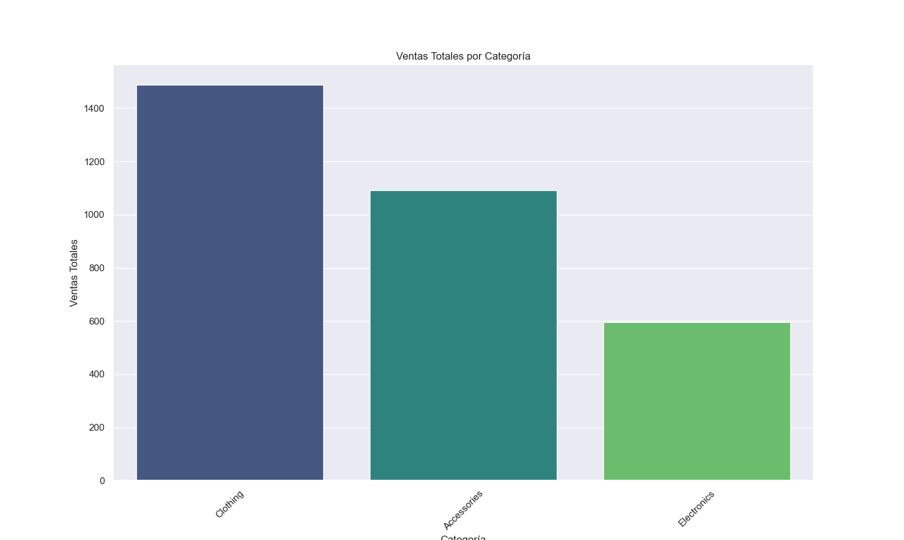
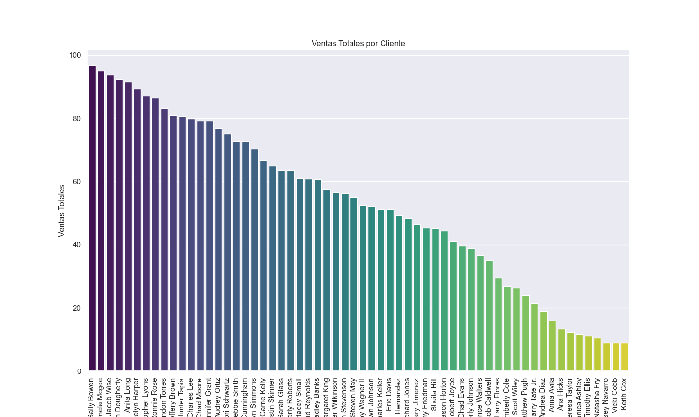
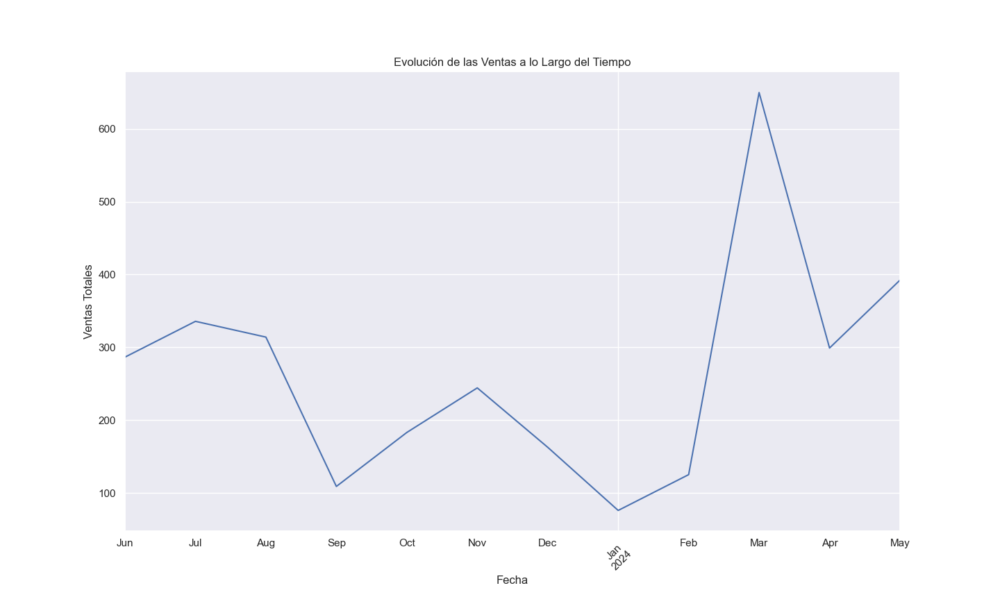

# Análisis y Visualización de Datos de una tiendita

## Descripción

Este proyecto realiza un análisis y visualización de datos de ventas de una tiendita utilizando datos ficticios generados para este ejemplo. 

## INTERPRETACIÓN DE LOS RESULTADOS:

Ventas Totales por Categoría:
La gráfica de barras mostrará qué categorías de productos generan más ingresos.
Las categorías en la parte superior de la gráfica son las que más contribuyen a las ventas totales.
Esto puede ayudar a identificar productos principales y orientar decisiones de inventario y marketing.


Ventas Totales por Cliente:
Similar a la anterior, esta gráfica indicará qué clientes son los más valiosos para el negocio.
Identificar a los mejores clientes puede ser útil para estrategias de fidelización y promociones dirigidas.


Evolución de las Ventas a lo Largo del Tiempo:
La gráfica de línea mostrará cómo han cambiado las ventas mensuales a lo largo del tiempo.
Se pueden identificar tendencias estacionales, picos y valles, lo que puede ayudar a planificar estrategias de venta y marketing en el futuro.


## Estructura del Proyecto

- `data/`: Contiene el conjunto de datos utilizado. 
- `src/`: Contiene scripts Python para el análisis.
- `README.md`: Descripción del proyecto e instrucciones.
- `requerimientos.txt`: Lista de dependencias necesarias.

## Instalación

1. Clona este repositorio.
2. Instala las dependencias:
    ```bash
    pip install -r requerimientos.txt
    ```

## Uso

Ejecuta el script de análisis:
```bash
python src/Analisis.py
